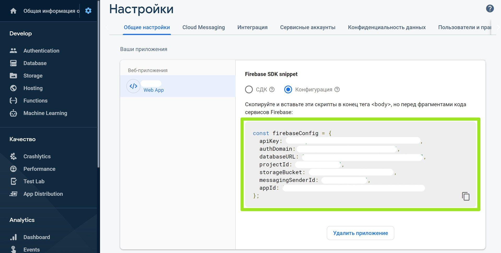

# WebTutor Push Notifications

Модуль позволяет [бесплатно](https://firebase.google.com/pricing) отправлять push-уведомления пользователям WebTutor с помощью [Firebase Cloud Messaging](https://firebase.google.com/docs/cloud-messaging)

[](https://www.youtube.com/watch?v=sioEY4tWmLI)

## Системные требования

* WebTutor ver.3.x.x.x + HTTPS + доступность портала в интернете
* MS SQL
* Node.js
* Chrome, Firefox, Opera, Edge и [другие](https://caniuse.com/#feat=push-api)

## Установка

1. [Создайте](https://console.firebase.google.com/u/0/) новый проект в Firebase
2. Из настроек скопируйте:

   - конфигурацию

      

    - ключ сервера

      

3. На сервере WebTutor установите [Node.js](https://nodejs.org/en/download/) 

4. В командной строке введите (директория может отличаться):

    ```sh
    cd C:\Program Files\WebSoft\WebTutorServer\wt\web
    npm init -y
    npm install @maksimyurkov/webtutor-push-notifications
    ```

5. В браузере откройте страницу 

    `https://<ваш домен>/node_modules/@maksimyurkov/webtutor-push-notifications/dist/index.html`

6. Заполните поля и нажмите `Сохранить`

7. Готово

## Отправка тестового уведомления

1. Откройте в браузере любую страницу WebTutor (кроме mode=default)

2. Дайте разрешение на получение уведомлений

3. В настройках модуля в разделе **Тест** выберите устройство и нажмите `Отправить`

4. В разделе **Очередь** нажмите `Запустить обработчик`

5. Готово

## Использование

### Отправка в WebTutor

Для отправки push-уведомлений в WebTutor используется обычная функция. В качестве единственного параметра функция принимает массив с объектами определенного формата

```js
interface Notification {
  users?: Array<Int>; // Массив с ID пользователей WebTutor
  instances?: Array<String>; // Массив с ID устройств пользователей WebTutor
  name?: String; // Название/Тип уведомления
  notification: Object; // Данные уведомления
}

/**
 * Добавляет уведомления в очередь на отправку
 *
 * @param {Array<Notification>} notifications массив с уведомленями
 * @returns {Boolean}
 */
function run(notifications) {
  .....
}
```

Функцию можно вставить в любое место где исполняется серверный код WebTutor (агент, шаблон уведомления, системное событие, веб-страница, различные поля в карточках, итп, место зависит от решаемых вами задач)

#### Примеры

```js
// Отправить push-уведомление на все устройства двух пользователей
OpenCodeLib("x-local://wt/web/node_modules/@maksimyurkov/webtutor-push-notifications/webtutor/functions/send.js").run([{
  users: [6706500681249617876, 6706500707718295314],
  name: "Назначение курса",
  notification: {
    "data": {
      "title": "Тайм-менеджмент",
      "body": "Вам назначен курс",
      "icon": "https://img.youtube.com/vi/JEJqy1Wlovw/mqdefault.jpg",
      "image": "https://img.youtube.com/vi/JEJqy1Wlovw/maxresdefault.jpg",
      "click_action": "https://en.wikipedia.org/wiki/Time_management"
    },
    "time_to_live": 3600
  }
}]);
```

```js
// Отправить push-уведомление на два устройства
OpenCodeLib("x-local://wt/web/node_modules/@maksimyurkov/webtutor-push-notifications/webtutor/functions/send.js").run([{
  instances: [
      "cm8iELkcaBySytfVGUg59_:APA91bHU7esgPw9o67Ps1NRH5JbH9_Y3c33c4ul0WZUew8PJ9mfak_Gqao3lfgY9RUJc59B5qN13ZYDRrff0bHdYOGo2k23P-rTBl5e_s_sJGDB0rsLo0Bw77snJeJJ6IE1jfJKIq1pI",
      "dePZm6iKwCWbWkr4fQN0nC:APA91bE_fcrSgpj0BMdTwGno2WFNYryOSOFD-76xClp9bZpFc9i1Bq62axUhU7rSQiMbGnq-6DeulTxKEI1yYdm2ikNCuZis-hShy9RwsqDd737dSTEfJytJ9IiZFDiRDuDF-4qcFmNc"
    ],
  name: "Назначение курса",
  notification: {
    "data": {
      "title": "Тайм-менеджмент",
      "body": "Вам назначен курс",
      "icon": "https://img.youtube.com/vi/JEJqy1Wlovw/mqdefault.jpg",
      "image": "https://img.youtube.com/vi/JEJqy1Wlovw/maxresdefault.jpg",
      "click_action": "https://en.wikipedia.org/wiki/Time_management"
    },
    "time_to_live": 3600
  }
}]);
```

### Отправка через HTTP запрос

Отправить push-уведомления можно из другой системы через HTTP запрос к WebTutor. Для этого потребуется сгенерировать секретный ключ в разделе **Ключи** и добавить его в заголовок запроса

**Внимание**

* Не используйте секретный ключ на клиентской стороне

* userId в массиве может передаваться в виде строки (на случай, если используемая система не поддерживает большие числа)

#### Пример

```js
// Отправить push-уведомления на все устройства пользователя
fetch("https://<ваш домен>/node_modules/@maksimyurkov/webtutor-push-notifications/webtutor/api.html?route=/send",
{
    method: "POST",
    mode: "cors",
    headers: {
      key:
        "5FAAEA83-20FF-4DDE-A34D-4C8A0EFFBD206C114692-CC63-4A74-9C27-7386DC85157FB2615A7D-A1D6-4459-9143-8A952242DAA37D5D461A-BC8D-4698-A91D-BCB295D6CB20",
    },
    body: JSON.stringify([{
        users: ["6148914691236317121"],
        name: "Назначение курса",
        notification: {
          data: {
            title: "Тайм-менеджмент",
            body: "Вам назначен курс",
            icon: "https://img.youtube.com/vi/JEJqy1Wlovw/mqdefault.jpg",
            image: "https://img.youtube.com/vi/JEJqy1Wlovw/maxresdefault.jpg",
            click_action: "https://en.wikipedia.org/wiki/Time_management"
          },
          time_to_live: 3600
        }
      }
    ])
  }
);
```

## Поддержка

Проблемы, ошибки, баги, пожелания фиксируются в [issues](https://github.com/maksimyurkov/webtutor-push-notifications/issues)


## Разработка

```sh
cd C:\Program Files\WebSoft\WebTutorServer\wt\web\node_modules\@maksimyurkov
git clone https://github.com/maksimyurkov/webtutor-push-notifications
cd webtutor-push-notifications
npm install
npm run start
```

В файле `/index.html` добавьте атрибут `api-url`

```html
<webtutor-push-notifications api-url="https://<ваш домен>/node_modules/@maksimyurkov/webtutor-push-notifications/webtutor/api.html"></webtutor-push-notifications>
```

После внесения изменений `npm run build` + pull request

## Лицензия

MIT License
